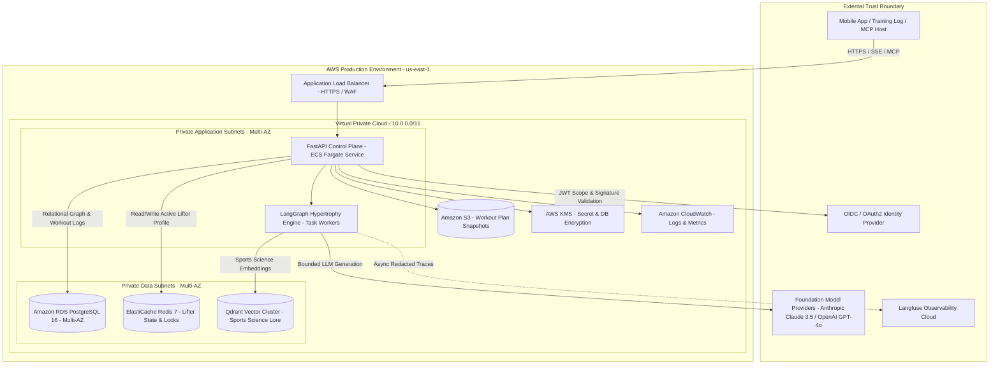
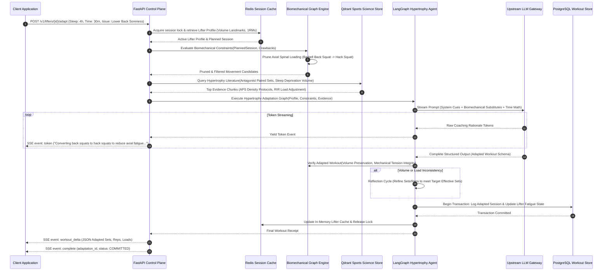
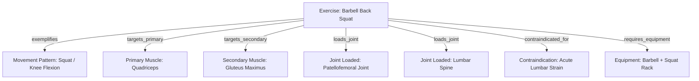

# Architecture: IronGraph-Engine

**Status**: Proposed service architecture and system design specification. [Index](Index.md) · [Class](Class.md) · [Operations](Operations.md)

---

## 1. Boundaries and Topology

### Architectural Subsystems
1. **API Admission & Control Plane**: FastAPI application responsible for client authentication, request validation (Pydantic v2), rate limiting, and Server-Sent Events (SSE) multiplexing.
2. **Biomechanical Graph & Rule Engine**: In-memory graph model (NetworkX adapter) backed by PostgreSQL. Evaluates physical causality rules, joint contraindications, and equipment availability before and after workout generation.
3. **LangGraph Hypertrophy Orchestrator**: Specialized agentic state machine coordinating volume landmark reconciliation, mechanical tension preservation, and time-density intensifier selection.
4. **Data Persistence**: PostgreSQL 16 stores lifter profiles, volume landmarks (MEV/MAV/MRV), historical logs, and the relational property graph. Redis 7 caches active session state and manages distributed concurrency locks.

---

## 2. Request & Workout Adaptation Lifecycle

The following sequence details how an atypical training session is admitted, analyzed, adapted, and streamed to the client:

---

## 3. Mathematical Foundations of Hypertrophy Autoregulation

### 1. The Stimulus-to-Fatigue Ratio (SFR) Optimization
To maximize muscle protein synthesis without overwhelming systemic recovery:
$$\text{SFR} = \frac{\text{Mechanical Tension} \times \text{Target Muscle Recruitment}}{\text{Axial Compressive Stress} + \text{Connective Tissue Inflammation} + \text{CNS Fatigue}}$$

* **Application on Low Sleep (<5h)**: Axial stress and CNS fatigue rise sharply. The engine substitutes high-axial exercises ($\text{Axial} \ge 8/10$) with high-stability, chest-supported or machine exercises ($\text{Axial} \le 2/10$), preserving mechanical tension while halving systemic fatigue.

### 2. Effective Hypertrophy Volume & RIR Preservation
Progressive overload for hypertrophy requires accumulating **effective sets** (sets within 0–3 Reps in Reserve / RIR):
$$\text{Effective Hypertrophy Stimulus} = \sum_{i=1}^{S} \left( \frac{1}{1 + \text{RIR}_i} \right) \cdot \mathbb{I}_{[\text{RIR}_i \le 3]}$$
If acute sleep loss elevates perceived exertion (RPE 9 at 80% 1RM instead of RPE 7), the engine recalibrates the load downwards by 5–8% to maintain the target 1–2 RIR without technical failure or form breakdown.

### 3. Time-Density Compression Formulations
When available time $T_{\text{avail}} < T_{\text{planned}}$:
- **Antagonist Paired Sets (APS)**: Exercises targeting opposing muscle groups (e.g., Chest Press + Upper Back Row) are interleaved with 90-second intra-set rest:
  $$T_{\text{APS}} \approx \frac{T_{\text{straight}}}{1.8} \quad (\approx 45\% \text{ reduction with identical mechanical tension})$$
- **Rest-Pause / Myo-Reps**: 1 activation set to failure + 4 mini-sets of 3–5 reps with 15s rest:
  $$S_{\text{effective}} = 5 \text{ sets in } 3.5 \text{ minutes vs } 12 \text{ minutes of straight sets.}$$

---

## 4. Biomechanical Property Graph Structure

The engine models the human muscular-skeletal movement domain as a directed property graph $G = (V, E)$:

When an atypical drawback (e.g. `equipment_occupied: squat_rack` or `symptom: lower_back_strain`) is reported, the graph engine performs an immediate constraint-propagation query to find candidate exercises with equivalent primary muscle vectors and minimal axial joint load.

---

## 5. Deliberate Architectural Trade-offs

| Decision | Trade-off Benefit | Cost / Revisit Trigger |
| :--- | :--- | :--- |
| **Relational Property Graph in PostgreSQL vs. Neo4j** | ACID transactions across lifter history and exercise graph; operational simplicity without multi-DB overhead. | Revisit if exercise graph traversals exceed 35ms under heavy concurrent load. |
| **Deterministic Pre-Filtering before LLM Prompting** | Eliminates dangerous biomechanical hallucinations before spending tokens; guarantees 100% adherence to physical rules. | Requires maintaining a structured, verified exercise taxonomy in the repository. |
| **Dual-Channel SSE Streaming (Prose + JSON Schema)** | Allows mobile training apps to display conversational coaching cues while rendering interactive set/rep inputs. | Requires client support for custom SSE event types (`token`, `workout_delta`, `complete`). |
| **Dynamic RIR Load Autoregulation vs. Fixed Percentages** | Prevents overtraining and injury on sleep-deprived days by prioritizing proximity to failure over arbitrary weight numbers. | Requires the lifter to have basic familiarity with RPE / RIR concepts (explained in coaching cues). |
