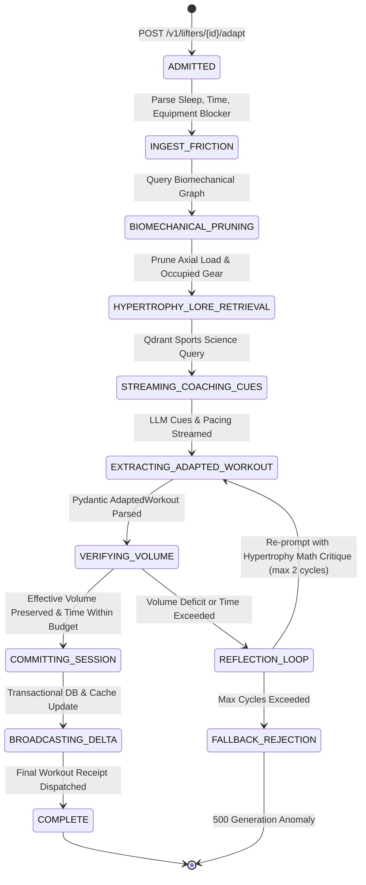

# Class & State Models: IronGraph-Engine

**Status**: Implementation blueprint and component specification. [Index](Index.md) · [Architecture](Architecture.md) · [Operations](Operations.md)

---

## 1. Class Diagram & Component Responsibilities

```mermaid
classDiagram
  class LifterProfile {
    +UUID lifter_id
    +str experience_tier
    +dict volume_landmarks_mev_mrv
    +dict baseline_1rm_kg
    +list~str~ active_contraindications
    +datetime created_at
  }

  class BiomechanicalGraph {
    +dict~str, ExerciseNode~ exercises
    +dict~str, MuscleNode~ muscles
    +dict~str, JointNode~ joints
    +filter_by_contraindications(contraindications: list) list~ExerciseNode~
    +find_substitutes(exercise_id: str, available_equipment: list) list~ExerciseNode~
    +get_axial_stress_score(exercise_id: str) float
  }

  class ExerciseNode {
    +str id
    +str label
    +str movement_pattern
    +list~str~ primary_muscles
    +list~str~ secondary_muscles
    +int axial_stress_rating
    +list~str~ required_equipment
  }

  class BiomechanicalRuleEngine {
    +evaluate_joint_safety(exercise: ExerciseNode, lifter: LifterProfile) bool
    +prune_contraindicated(exercises: list, drawbacks: DailyDrawbacks) list
  }

  class HypertrophyMathEngine {
    +calculate_sfr(tension: float, axial: float, cns: float) float
    +calculate_effective_volume(sets: list) int
    +compress_via_aps(exercises: list, available_minutes: int) list~AdaptedExerciseSet~
    +apply_myo_reps(exercise: ExerciseNode) AdaptedExerciseSet
    +autoregulate_rir(base_load: float, sleep_hours: float) float
  }

  class LangGraphHypertrophyOrchestrator {
    +StateGraph workflow
    +execute_adaptation(state: AutoregulationState) AsyncIterator~AdaptationStreamChunk~
    -_node_ingest_friction(state: AutoregulationState) AutoregulationState
    -_node_prune_graph(state: AutoregulationState) AutoregulationState
    -_node_query_hypertrophy_lore(state: AutoregulationState) AutoregulationState
    -_node_generate_adaptation(state: AutoregulationState) AutoregulationState
    -_node_verify_effective_volume(state: AutoregulationState) AutoregulationState
    -_node_reflection(state: AutoregulationState) AutoregulationState
    -_node_commit(state: AutoregulationState) AutoregulationState
  }

  class AutoregulationState {
    +UUID adaptation_id
    +UUID lifter_id
    +DailyDrawbacks drawbacks
    +WorkoutPlan planned_workout
    +list~ExerciseNode~ allowed_exercises
    +AdaptedWorkout proposed_workout
    +int target_effective_volume
    +int reflection_attempts
    +bool is_valid
  }

  class DailyDrawbacks {
    +float sleep_hours
    +int available_minutes
    +list~str~ occupied_equipment
    +list~str~ localized_pain_symptoms
    +int subjective_readiness_1_to_10
  }

  class AdaptedWorkout {
    +list~AdaptedExerciseSet~ exercises
    +int estimated_duration_min
    +int total_effective_sets
    +str sfr_rating
    +str coaching_rationale
  }

  class AdaptedExerciseSet {
    +str exercise_id
    +str exercise_label
    +int sets
    +str rep_range
    +float target_rir
    +float recommended_load_kg
    +int rest_seconds
    +str intensifier_type
    +str paired_exercise_id
  }

  class LLMProviderStrategy {
    <<interface>>
    +stream_generation(prompt: str, schema: type) AsyncIterator~str~
  }

  class AnthropicAdapter {
    +stream_generation(prompt: str, schema: type) AsyncIterator~str~
  }

  class OpenAIAdapter {
    +stream_generation(prompt: str, schema: type) AsyncIterator~str~
  }

  LifterProfile "1" --> "1" BiomechanicalGraph
  BiomechanicalGraph "1" *-- "*" ExerciseNode
  LangGraphHypertrophyOrchestrator --> BiomechanicalRuleEngine
  LangGraphHypertrophyOrchestrator --> HypertrophyMathEngine
  LangGraphHypertrophyOrchestrator --> AutoregulationState
  LangGraphHypertrophyOrchestrator --> LLMProviderStrategy
  LLMProviderStrategy <|.. AnthropicAdapter
  LLMProviderStrategy <|.. OpenAIAdapter
  AutoregulationState --> DailyDrawbacks
  AutoregulationState --> AdaptedWorkout
  AdaptedWorkout "1" *-- "*" AdaptedExerciseSet
```

---

## 2. Autoregulation State Machine Lifecycle

The LangGraph orchestration lifecycle models the ingestion of daily drawbacks, biomechanical filtering, volume calculation, LLM adaptation, and streaming:

---

## 3. Core Software Design Patterns Applied

### 1. Strategy Pattern (`LLMProviderStrategy`)
Decouples prompt execution from concrete model vendors (Anthropic Claude 3.5 Sonnet, OpenAI GPT-4o, AWS Bedrock). Allows seamless failover if an upstream provider experiences transient outages.

### 2. Specification Pattern (`BiomechanicalRuleEngine`, `CausalityRule`)
Encapsulates human anatomical and joint safety rules as testable specification classes. This guarantees that contraindications (e.g. `SpinalCompressiveThresholdRule`, `ShoulderImpingementClearanceRule`) are enforced deterministically without LLM ambiguity.

### 3. Math Engine Separation (`HypertrophyMathEngine`)
Offloads all numeric calculations—volume landmark bounds (MEV, MRV), RIR-to-%1RM conversions, Antagonist Paired Set time savings, and rest-pause density formulas—to a high-speed Python module, avoiding LLM arithmetic inaccuracies.
