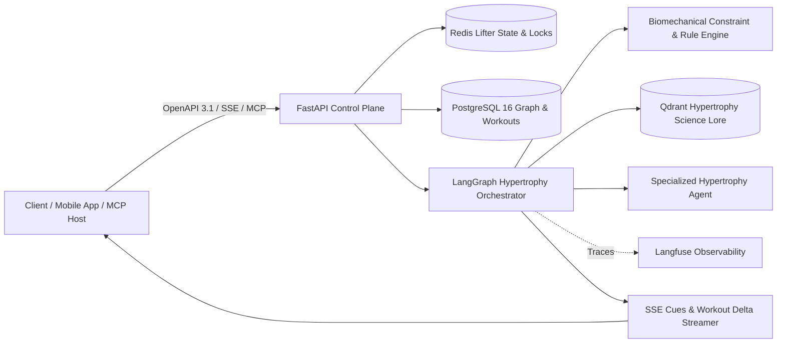

# IronGraph-Engine

A headless, graph-augmented workout autoregulation engine and sports performance service designed to solve a core problem in athletic training: **how can a resistance training program adapt sets, reps, and loads to real-world friction (sleep deprivation, severe time crunches, crowded gym equipment, joint inflammation) without sacrificing progressive overload and while maximizing skeletal muscle hypertrophy?**

This portfolio project demonstrates advanced AI systems architecture, asynchronous backend engineering, Biomechanical Knowledge Graphs, and evidence-based sports science autoregulation relevant to **AI Engineer**, **LLM Systems Engineer**, and **Backend AI / Applied AI Systems Architect** roles. It integrates an expert **Hypertrophy & Sports Performance Agent** with deterministic anatomical constraint graphs, Pydantic v2 strict schemas, and Server-Sent Events (SSE) streaming.

**Status: Phase 2 architecture and documentation scaffolding. No production API or live AWS infrastructure is currently provisioned.** The OpenAPI 3.1 contracts, schema definitions, PostgreSQL DDL schemas, Docker compose environment, and multi-tier architectural specifications below are fully scaffolded and verified.

---

## Design at a glance



Python 3.12, FastAPI, AsyncIO, Pydantic v2, and OpenAPI 3.1 form the headless control plane. PostgreSQL 16 acts as the authoritative relational property graph (muscles, joints, exercises, contraindications) and historical workout log; Redis 7 provides low-latency active session caching and distributed concurrency locks; Qdrant supplies peer-reviewed exercise science retrieval; LangGraph drives the specialized hypertrophy adaptation state machine; Docker and Terraform define cloud delivery on AWS ECS Fargate.

---

## Planned API Consumption

These commands illustrate the consumption pattern against the headless service (`IRONGRAPH_URL`).

### 1. Register Lifter Profile & Volume Landmarks
```bash
curl --fail-with-body -X POST "$IRONGRAPH_URL/v1/lifters" \
  -H "Authorization: Bearer $IRON_TOKEN" \
  -H "Content-Type: application/json" \
  --data-binary @examples/create_lifter_profile.json
# Returns 201 Created + JSON with lifter_id and baseline volume landmarks
```

### 2. Request Atypical Workout Adaptation (SSE Streaming)
Submit an atypical training scenario (e.g. 4 hours of sleep, only 30 minutes to train, squat rack unavailable):
```bash
curl -N -X POST "$IRONGRAPH_URL/v1/lifters/$LIFTER_ID/adapt" \
  -H "Authorization: Bearer $IRON_TOKEN" \
  -H "Content-Type: application/json" \
  -H "Accept: text/event-stream" \
  --data-binary @examples/atypical_adaptation_request.json
```
*Stream output delivers chunked coaching rationale and structured JSON adapted workout schemas:*
```text
event: token
data: {"text": "Given severe sleep deprivation (4 hrs) and a 30-min window, we are eliminating axial spinal loading."}

event: token
data: {"text": " Converting Barbell Back Squats to Hack Squats, and pairing Incline Dumbbell Presses with Chest-Supported Rows in an Antagonist Paired Set (APS) to compress session time by 42% while preserving target mechanical tension."}

event: workout_delta
data: {"adapted_exercises": [...], "estimated_duration_min": 28, "target_effective_sets": 10, "sfr_rating": "OPTIMAL"}

event: complete
data: {"adaptation_id": "adapt_01HXYZ...", "status": "COMMITTED"}
```

### 3. Request 1:1 Biomechanical Exercise Substitution
```bash
curl --fail-with-body -X POST "$IRONGRAPH_URL/v1/exercises/substitute" \
  -H "Authorization: Bearer $IRON_TOKEN" \
  -H "Content-Type: application/json" \
  --data-binary @examples/exercise_substitution.json
# Returns 200 OK with top 3 biomechanically matched exercises preserving muscle length tension curve
```

---

## Available Locally

Run the complete local development environment using Docker Compose and Python scripts:

```powershell
# 1. Setup Python virtual environment and dependencies
python -m venv .venv
.venv\Scripts\python -m pip install -r requirements-dev.txt

# 2. Run automated scaffold and contract validation
.venv\Scripts\python scripts/validate_scaffold.py

# 3. Spin up local database, cache, and vector storage
Copy-Item .env.example .env
docker compose config --quiet
docker compose up -d postgres redis qdrant

# 4. Verify PostgreSQL relational graph schema
docker compose exec postgres psql -U irongraph -d irongraph_db -c "\dt"

# 5. Teardown
docker compose down
```

---

## Engineering Proof & Next Steps

| Capability | Phase 2 Scaffolding Evidence | Phase 3 Implementation Proof |
| :--- | :--- | :--- |
| **API & Schema Contracts** | OpenAPI 3.1 specification, JSON Schemas, validated sample fixtures | FastAPI route handlers, Pydantic v2 strict models, integration tests |
| **Biomechanical Graph** | Relational graph DDL schema linking muscles, exercises, and contraindications | NetworkX in-memory graph adapter with recursive CTE SQL queries |
| **Hypertrophy Autoregulation** | Deterministic volume landmark and Stimulus-to-Fatigue Ratio (SFR) algorithm | Autoregulation engine testbench validating mechanical tension preservation |
| **Atypical Constraints Engine** | Time-density intensifiers (Antagonist Paired Sets, Myo-reps, RIR adjustments) | Quantitative volume validation asserting zero lost effective hypertrophy sets |
| **Agentic Orchestration** | LangGraph state graph with reflection and constraint check loops | Live LLM integration with self-correcting workout schema enforcement |
| **Infrastructure as Code** | Terraform ECS Fargate, RDS, ElastiCache, S3 blueprints | Verified staging deployment with automated GitHub Actions CI/CD |

---

## Documentation Index & Deep Links

- **System Architecture**: [Architecture.md](Architecture.md) — Topology, request lifecycle, hypertrophy mathematics, SFR models
- **Class & State Machine Models**: [Class.md](Class.md) — Component responsibilities, LangGraph agent nodes/edges, design patterns
- **Technical Index**: [Index.md](Index.md) — Complete endpoint mapping, service specs, contracts
- **Operational Runbook**: [Operations.md](Operations.md) — Local development, telemetry, disaster runbooks
- **Project Brief**: [PROJECT_BRIEF.md](PROJECT_BRIEF.md) — Product vision, constraints, and non-goals
- **Detailed Specifications**:
  - [API Conventions](docs/api/conventions.md)
  - [Workout Adaptations API](docs/api/adaptations.md)
  - [Lifters Profile API](docs/api/lifters.md)
  - [Hypertrophy Agent Subsystem](docs/services/hypertrophy-agent.md)
  - [Biomechanical Graph Engine](docs/services/graph-engine.md)
  - [Autoregulation Math & Logic](docs/services/autoregulation.md)
  - [Cloud Deployment & Terraform](docs/delivery/deployment.md)
