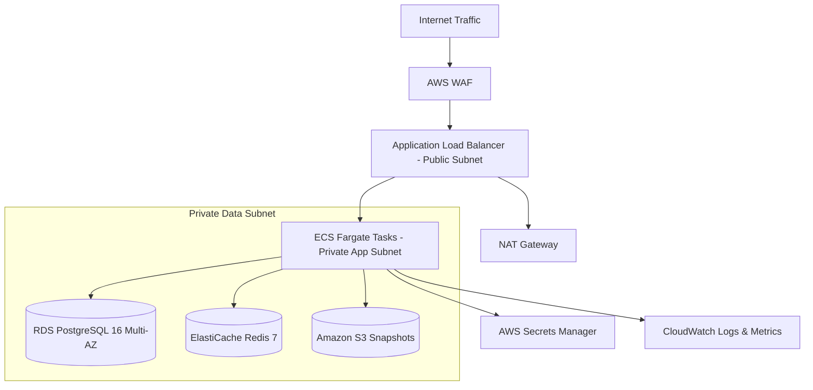

# Delivery Blueprint: AWS Production Cloud Deployment

## 1. Cloud Architecture Overview
IronGraph-Engine is deployed to **Amazon Web Services (AWS)** using containerized serverless infrastructure to guarantee high availability, zero idle costs, and sub-second scaling.

- **Compute**: AWS ECS Fargate running Python 3.12 containers in private VPC subnets.
- **Relational & Graph Store**: Amazon RDS PostgreSQL 16 (Multi-AZ) with encrypted EBS storage.
- **In-Memory Cache**: Amazon ElastiCache Redis 7 (Cluster mode with replication).
- **Snapshot Storage**: Amazon S3 with SSE-KMS encryption for workout history archives.
- **Traffic Ingress**: Application Load Balancer (ALB) terminating TLS 1.3 with AWS WAF.

## 2. Capacity Sizing & Cost Projections

| Component | Staging Tier | Production Tier | Purpose |
| :--- | :--- | :--- | :--- |
| **ECS Fargate Task** | 0.5 vCPU / 1 GB RAM (1 task) | 1.0 vCPU / 2 GB RAM (2–6 auto-scaled tasks) | FastAPI & LangGraph orchestrator |
| **RDS PostgreSQL** | `db.t4g.micro` (Single-AZ) | `db.r7g.large` (Multi-AZ, Provisioned IOPS) | Relational exercise graph & lifter profiles |
| **ElastiCache Redis** | `cache.t4g.micro` (Single node) | `cache.m7g.large` (Multi-AZ, 1 replica) | Active lifter session locks and graph cache |
| **Amazon S3** | Standard storage | Standard + Lifecycle to Standard-IA | Historical workout snapshots |
