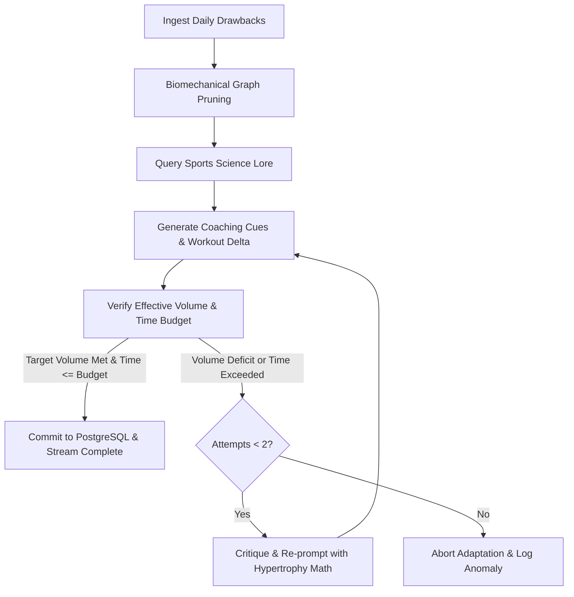

# Subsystem: Specialized Hypertrophy & Sports Performance Agent

## 1. Agent Architecture & Role
The **Hypertrophy & Sports Performance Agent** is an expert system implemented via a LangGraph state graph. Unlike general-purpose conversational LLMs that recommend generic light workouts when fatigue occurs, this agent is explicitly conditioned on **contemporary hypertrophy physiology (Schoenfeld, Israetel, Beardsley, Helms)**:

- **Core Objective**: Maximize muscle protein synthesis and mechanical tension while minimizing systemic and connective tissue fatigue on suboptimal training days.
- **Key Philosophy**: Never sacrifice progressive overload. When time, sleep, or equipment constraints arise, adapt the session's density, stability, and load distribution to preserve target effective volume.

---

## 2. LangGraph State Machine Graph

---

## 3. Node Specifications & Mathematical Constraints

1. **`ingest_friction`**: Parses sleep hours, time budget, and equipment availability into a strongly typed `DailyDrawbacks` model.
2. **`prune_graph`**: Calls the Biomechanical Graph Engine to eliminate movements with excessive axial spinal loading ($\ge 7/10$) if sleep is under 5 hours, or where equipment is blocked.
3. **`query_hypertrophy_lore`**: Fetches evidence-based density literature from Qdrant (e.g. Antagonist Paired Set protocols, rest-pause efficacy, lengthened partials).
4. **`generate_adaptation`**: Streams chunked coaching rationale via SSE while extracting structured Pydantic `AdaptedExerciseSet` records.
5. **`verify_effective_volume`**: Asserts that total effective sets satisfy:
   $$\text{Adapted Effective Sets} \ge 0.85 \times \text{Planned Effective Sets}$$
   and estimated session duration satisfies:
   $$\text{Estimated Duration} \le \text{Available Minutes}$$
6. **`critique_reflection`**: If the LLM dropped too many sets instead of using time-density intensifiers (APS or myo-reps), this node injects a mathematical critique forcing the agent to compress rest periods and pair exercises rather than deleting volume.
7. **`commit_session`**: Atomically inserts the adapted session into PostgreSQL and updates the lifter's fatigue ledger in Redis.
